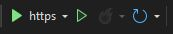
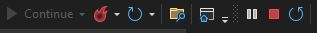

# Setup

<!-- For full documentation visit [mkdocs.org](https://www.mkdocs.org). -->
To start editing the web application open:

* `app.py` file located in the NpFast folder using VS Code.
* `BlazorApp2.sln` file located in the NpWeb folder using Microsoft Visual Studio.

### How to start editing PQM Dashboard Website

=== "`app.py`"
    
    In the terminal, type below to turn local server on
    ```py
    fastapi dev .\app.py 
    ```

=== "`BlazorApp2.sln`"
    <figure markdown="span">    
    { width="200" }
        <figcaption>To view/build the website, press the https button.</figcaption>
    </figure>

    <figure markdown="span">    
    { width="400" }
        <figcaption>After any small changes are made, press the fire icon to "hot reload" the page and see the changes
    To close down website, press the stop icon.</figcaption>
    </figure>

    !!! note
        To view larger changes made, close website down, then build website again!


<!-- ## Commands

* `mkdocs new [dir-name]` - Create a new project.
* `mkdocs serve` - Start the live-reloading docs server.
* `mkdocs build` - Build the documentation site.
* `mkdocs -h` - Print help message and exit. 
* `git init - push to github...
* `git add .
* `git status - see what is being added
* `git commit -m 'Initial commit'
* `git remote add origin https://github.com/jessicazonneveld/PQM_Dashboard.git
* `git push origin master    OR    git push origin main -->


